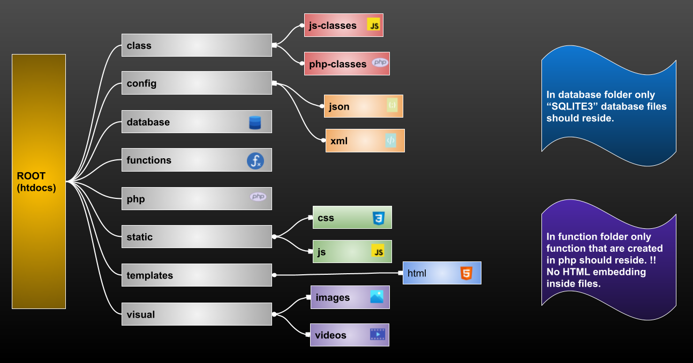

# PHP Project Structure
- #### **This is the structure that is created, to build the whole project which is PHP based.**
- #### **This is kind of boiler plate for the project.**
- #### **This structure will help the user to organize the files.**
<dl>
<dt><b style="color: red;">/class/js-classes/</b></dt>
<dd>Create folders according to the name of the class to implement easily. Ex: <i style="color:yellow">/class/js-classes/User/User.js</i>. File Allowed: <b style="color:limegreen;">.js</b></dd>
<dt><b style="color: red;">/class/php-classes/</b></dt>
<dd>Create folders according to the name of the class to implement easily. Ex: <i style="color:yellow">/class/php-classes/create_account/create_account.php</i> it defines that account for account creation use this class. File Allowed: <b style="color:limegreen;">.php</b></dd>
<dt><b style="color: red;">/config/json/</b></dt>
<dd>Here we have to create more folders depends on the project needs and add files into those folders. Ex: <i style="color:yellow">/config/json/settings/setting.json</i>. File Allowed: <b style="color:limegreen;">.json</b></dd>
<dt><b style="color: red;">/config/xml/</b></dt>
<dd>Here we have to create more folders depends on the project needs and add files into those folders. Ex: <i style="color:yellow">/config/xml/user-details/user_details.xml</i>. File Allowed: <b style="color:limegreen;">.xml</b></dd>
<dt><b style="color: red;">/database/</b></dt>
<dd>Ex: <i style="color:yellow">/database/account/accounts.db</i> to store pre-configured database files. File Allowed: <b style="color:limegreen;">.sqlite3 .db</b></dd>
<dt><b style="color: red;">/functions/</b></dt>
<dd>Create folders according to the use of the function which is going to be defined in it. Ex: <i style="color:yellow">/functions/delete/delete.php</i> it indicates that functions related to deletion are here. File Allowed: <b style="color:limegreen;">.php</b></dd>
<dt><b style="color: red;">/php/</b></dt>
<dd>Please create folders for every application in it. Ex: <i style="color:yellow">/php/database/database.php</i> to store php file for databases. File Allowed: <b style="color:limegreen;">.php</b>
<dt><b style="color: red;">/static/css/</b></dt>
<dd>Create folders and name them according to application and templates. And then add stylesheet depends on that particular application. Ex: <i style="color:yellow">/static/css/header/header.css</i> to store stylesheet for files that is used as header. File Allowed: <b style="color:limegreen;">.css</b></dd>
<dt><b style="color: red;">/static/js/</b></dt>
<dd>Create folders and name them according to application and templates. And then add scripts depends on that particular application. Ex: <i style="color:yellow">/static/js/footer/footer.js</i> to store scripts for files that is used as footer. File Allowed: <b style="color:limegreen;">.js</b></dd>
<dt><b style="color: red;">/templates/html/</b></dt>
<dd>Create folders according to their use, because these files are going to be used again and again. Ex: <i style="color:yellow">/templates/html/header/header.html</i> to store markup files that are going to be used in header. File Allowed: <b style="color:limegreen;">.html</b></dd>
<dt><b style="color: red;">/visual/images/</b></dt>
<dd>Create folders according to use and add images with names that describe them easily. Ex: <i style="color:yellow">/visual/images/homepage/home.png</i> to store images that are going to be represented on homepage. File Allowed: <b style="color:limegreen;">.png .jpeg .jpg .webp</b></dd>
<dt><b style="color: red;">/visual/videos/</b></dt>
<dd>Create folders according to use and add videos with names that describe them easily. Ex: <i style="color:yellow">/visual/videos/blogs/blog.mpeg</i> to store videos that are going to be represented on blogs. File Allowed: <b style="color:limegreen;">.mpeg .mp4</b></dd>
</dl>

___
## Folder and File Structure Inside The Root
___
- class
  - js-classes
    - Account
      - Account.js 
  - php-classes
    - User
      - User.php 
___
- config
  - json
    - javascript object notation 1
      - json1.json
    - javascript object notation 2
      - json2.json
  - xml
    - extensible markup 1
      - xml1.xml
    - extensible markup 2
      - xml2.xml
___
- database
  - database 1
    - account.db
___
- functions
  - data delete
    - data_del.php 
___
- php
  - php 1
    - php1.php
  - php 2
    - php2.php
___
- static
  - css
    - stylesheet 1
      - css1.css
    - stylesheet 2
      - css2.css
  - js
    - javascript 1
      - js1.js
___
- templates
  - html 
    - template 1
      - html1.html
    - template 2 
      - html2.html
___
- visual
  - images
    - pictures one
      - img.png
    - pictures two
      - img.jpeg
  - videos
    - graphics 1
      - video.mpeg
    - graphics 2
      - video2.mp4
___
#### Folders are represented with folder image at the end.
#### Files are represented with their respective extensions. Ex: .html - .js - .php and image at the end

___

### **To Clone The Structure Do This:-**
___
```
  gh repo clone j-ashish/php-structure
```
<div style="border-top: 1px solid green"></div>

|   Author    |      Description      |              WebSite              |
| :---------: | :-------------------: | :-------------------------------: |
| Ashish Jain | PHP Project Structure | [Ashish](http://ashishjain.rf.gd) |

<div style="border-top: 1px solid green"></div>


  


